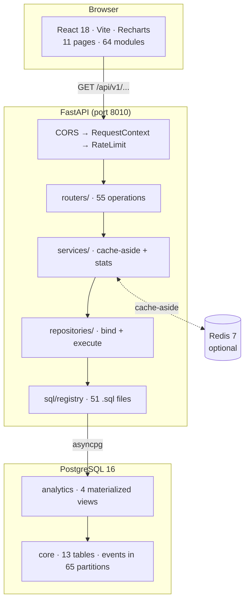

# Architecture

A read-only analytics service over a simulated streaming dataset. Postgres holds
the data, FastAPI serves 55 operations over it, React renders eleven dashboard
pages. Nothing writes except the seeder and one admin endpoint that refreshes
materialized views.

## The shape



Four layers behind the routes, each with one job:

| Layer | Responsibility | Does not |
| --- | --- | --- |
| `routers/` | Declare parameters and response models, return the envelope | Contain SQL or business logic |
| `services/` | Cache-aside, statistics, response assembly | Know about HTTP or the driver |
| `repositories/` | Bind parameters, execute, return mappings | Interpret the numbers |
| `sql/` | The 51 queries, as files | Anything else |

The layering is not ceremony. It is what makes the SQL testable without an app
(`test_queries_execute.py` calls the registry directly), the statistics testable
without a database (`test_stats.py`), and the contract testable without asserting
on numbers (`test_api_contract.py`).

## SQL lives in files, not in Python

`app/sql/queries/**.sql`, 51 files across 15 namespaces, plus 3 shared fragments
spliced in with `{{fragment_name}}`. The registry loads them once at startup,
extracts each query's bind parameters with SQLAlchemy's own regex, and compiles
each to a cached `TextClause`.

Three consequences worth stating:

- A query is readable as SQL, in a file, with comments explaining its reasoning.
  Several are 60+ lines with window functions; embedded in Python string literals
  they would be unreviewable.
- `bind_params` intersects what a caller supplies against what the registry says
  the query declares, and **discards the rest**. So a `FilterSet` can render all
  eight filter keys and a query that wants two gets two. A parameter the registry
  fails to report would be silently dropped, which is why a unit test asserts the
  registry's parameter set equals what the SQL actually contains.
- No ORM in the read path. `app/db/models.py` exists for Alembic's autogenerate;
  every analytical query is hand-written SQL, because window functions,
  `PERCENTILE_CONT`, `FILTER` clauses and lateral joins are the whole point and an
  ORM would be an obstacle to each of them.

### The cast rule

Every cast of a bind parameter is written `CAST(:param AS type)`, never
`:param::type`. SQLAlchemy's bind regex ends with a negative lookahead
`(?![:\w$])`, so a colon-prefixed name followed by `::` is **not recognised as a
parameter** — the text reaches Postgres literally and unbound. This cost a phase-6
debugging session, so a test now scans every `.sql` file on disk and fails the
build if the shorthand reappears. It also asserts its own pattern matches, because
a scanner with a broken regex reports "no offenders" forever.

## Two drivers, deliberately

`asyncpg` for the API's read path, `psycopg3` for Alembic and the seeder.

asyncpg is the faster async driver and the API is entirely async reads. But it has
no synchronous mode, and both Alembic and the seeder are synchronous by nature —
the seeder in particular uses `COPY` to load ~1.1M events, which is the only sane
way to do it and is psycopg's strength.

The cost of two drivers is one real trap: asyncpg is strict where psycopg was
lenient. `CAST(:d AS date)` needs an actual `datetime.date`; an ISO string raises
`'str' object has no attribute 'toordinal'` from inside the driver. Hence
`_coerce_date`, and its `datetime`-subclass exclusion — `datetime` IS-A `date`, so
an `isinstance` guard alone would hand a timestamp to a date column.

## Caching

Cache-aside in `services/`, with Redis as the backend when it is reachable and a
bounded in-process LRU when it is not. Redis is genuinely optional: the compose
file starts it, and disabling it changes latency and nothing else. CI runs with it
off.

The two backends do not behave the same, and that is the interesting part.
`RedisCache` serialises with `json.dumps(..., default=str)`, so a `Decimal`
returns as a string and a `date` as `"2024-01-01"`. `LocalCache` stores live Python
objects. Left alone, every repository's type guarantee would hold on a cache miss
and break on a hit — and hold locally while breaking under Redis.

`app/core/cache.py` is a frozen file, so rather than edit it, `services/base.py`
wraps both paths in a tagged codec: `Decimal("12.34")` encodes as
`{"__t": "dec", "v": "12.34"}` and decodes back to a `Decimal`. It runs when
encoding a **freshly computed** result too, which looks redundant and is the
point: a codec bug surfaces on the first request rather than on the first cache
hit, and no caller can come to depend on richer types that only a miss returns.

## Middleware

Three, and the order matters. `add_middleware` makes the last-added outermost, so
a request passes through:

**CORS → RequestContext → RateLimit → the app**

- **CORS** outermost, so a rejected preflight never consumes a rate-limit token.
- **RequestContext** assigns the request ID that appears in every log line, in the
  `X-Request-ID` header and in `meta.request_id`. A user reporting a wrong chart
  can quote one string that finds the exact request in the logs.
- **RateLimit** is a token bucket per client address: 60 tokens, refilling at 240
  per minute. Sized so one page load — which fires a dozen requests at once —
  cannot rate-limit itself. `/health`, `/docs` and `/openapi.json` are exempt,
  because a liveness probe on a fixed interval would otherwise compete with real
  traffic.

  Per worker, not per cluster: the bucket table is a dict in the process. Under
  `--workers N` the effective limit is N times the configured one. That is a
  deliberate trade for a service that must run from one `docker compose up` with
  no shared store. It bounds accidental load — a runaway `useEffect`, a scraper, a
  forgotten load test. It is not a defence against a distributed attacker, and
  nothing claims otherwise.

Rejections are **rendered** rather than raised. A `raise` from middleware never
reaches FastAPI's exception handlers and degrades to a bare 500, so the limiter
builds its own RFC 7807 response.

### `strict_query`

An undeclared query parameter is a **422**, not silently ignored. FastAPI's default
is to drop unknown parameters, which means a typo like `date_form` returns a
cheerful 200 for the wrong window. Loud is correct: the alternative is confidently
wrong data.

This is why the window is not uniform across the API and cannot be treated as
such. 34 routes take `date_from`+`date_to`, 10 also take `observation_end`, 7 take
no window, `/geo/country-ranking` takes `date_to` only, and the two experiment
routes take `observation_end` only. The frontend has a `windowParamsFor(path,
window)` helper that strips per path, because spreading one window everywhere
would 422 on twenty routes.

## The response envelope

Every route but `/health` returns:

```json
{
  "data": [ ... ],
  "meta": {
    "cache": "HIT",
    "rows": 546,
    "window": { "date_from": "2025-02-07", "date_to": "2026-08-06", "days": 546 },
    "filters_applied": false,
    "generated_at": "2026-08-08T12:36:24Z",
    "request_id": "bc0aaaa7183a4ebe9f3a564608c135ba"
  }
}
```

There is no `rows` key at the top level — the frontend's `usePanel` hook *derives*
its rows from `payload.data` when that is an array. Four endpoints put an object
there instead: both `/meta` routes, `/overview`, and the experiment results.

`/health` is deliberately unenveloped. It is a probe for orchestrators, which
should not need to understand this project's wrapper, and it must stay answerable
when the database is down — the moment a `{data, meta}` envelope would be least
truthful.

## Errors

RFC 7807 problem documents, with one documented exception.

| Condition | Status | Body |
| --- | --- | --- |
| Bad, missing, inverted or undeclared parameter | 422 | `problems/validation-error` |
| Unknown experiment key | 404 | `problems/not-found` |
| Missing or wrong admin key | 401 | problem document |
| Wrong verb on a real route | 405 | problem document |
| Over the rate limit | 429 | `problems/rate-limit` + `Retry-After` |
| **Path matching no route** | 404 | `{"detail": "Not Found"}` |

The last one never reaches this project's handlers, so it gets Starlette's
default. Recorded rather than normalised: intercepting every unmatched path to
make it uniform would be work in service of consistency alone, and the two 404s
genuinely mean different things — "no such endpoint" versus "no such row".

## Frontend

64 TypeScript modules. Eleven pages, statically imported: `React.lazy` would add a
suspense boundary on top of the skeletons each page already renders, so a user
would wait twice.

`usePanel` is the single data-fetching hook. It wraps TanStack Query, strips the
window parameters a given path does not declare, and exposes `rows` derived from
the envelope.

Two conventions the whole UI rests on:

**A `null` is an undefined figure, never zero.** `EMPTY = '—'`,
`connectNulls={false}` on every line chart, heatmap nulls painted outside the
colour ramp with a dedicated `--heat-null` token. A gap in a chart is a gap, not a
dip to zero. The MRR waterfall is the single documented exception, where a null
movement genuinely means "no revenue moved that way" and is summed as zero.

**Three percentage conventions, and mixing them is a factor-of-100 bug.** Columns
ending `_pct` are pre-multiplied (`51.1` means 51.1%, formatted with
`formatPercent`). `completion_rate` and `avg_completion_rate` are 0–1 fractions
(`formatRatioAsPercent`). `traffic_allocation` and `observed_power` are also
fractions.

TypeScript is compiled with `tsc --build`, never a bare `tsc --noEmit`. The root
`tsconfig.json` is `{"files": [], "references": [...]}`, and a bare invocation does
**not** follow project references — it checks zero files and exits 0. That produced
a run of vacuous green results during phase 11 while two real type errors sat in
the tree.

## Testing

330 tests, in two tiers.

**Unit (167)** — no database. Statistics against closed forms rather than recorded
output (the Cauchy CDF at df=1, the published t-table, Wilson intervals), the cache
codec's type parity, `FilterSet` normalisation, the SQL registry's guarantees.

**Integration (163)** — a live seeded Postgres, opted into with `PRISM_TEST_DB`.
Three files: every registered query executes; the numbers satisfy identities that
must hold whatever the data is; all 55 operations honour the contract.

The value assertions close the build plan's own open limitation, which read: *"the
queries are verified to EXECUTE and return plausible shapes, not to return CORRECT
numbers."* They assert relationships rather than literals — a funnel's stage rates
multiply to its end-to-end rate, an MRR waterfall balances opening to closing, a
risk score equals the sum of its five components, rolling retention is never below
classic retention, conversion rises monotonically with watch time. Pinning
literals would fail on every reseed while proving nothing, since the expected value
would have been copied from the query under test.

One harness detail that is load-bearing: **one connection per query.** A phase-6
harness ran everything in a single transaction, and the first genuine failure
aborted it — the remaining 47 calls then failed with
`InFailedSQLTransactionError`, burying the real error and pointing at the wrong
queries.
