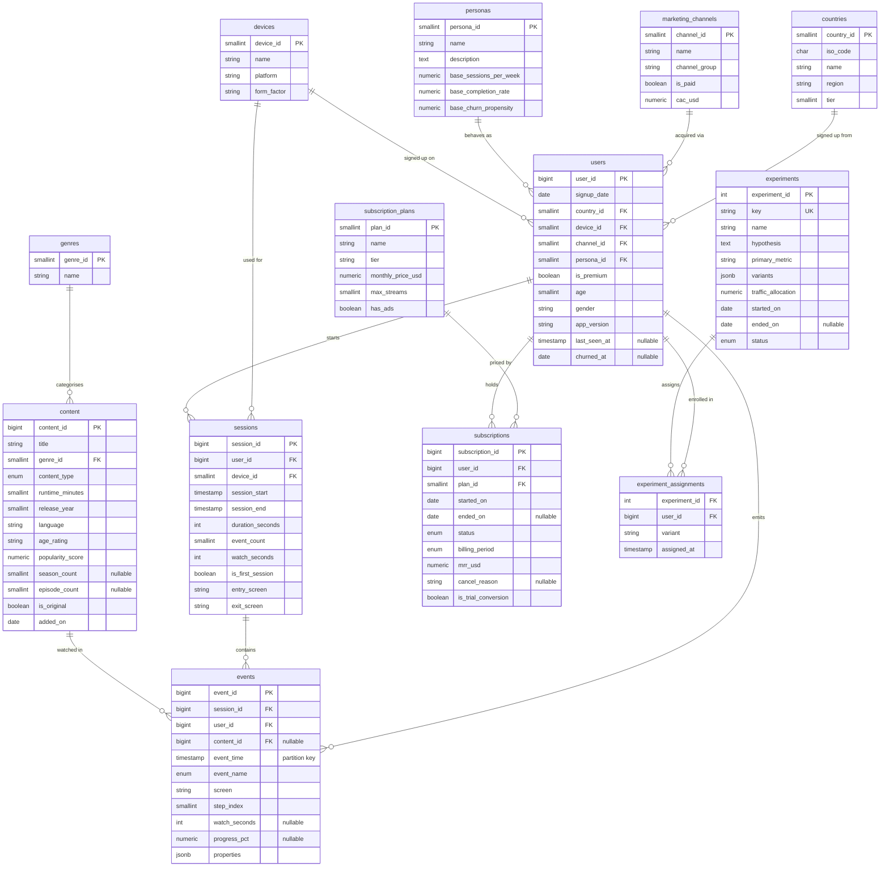

# Data model

Two schemas. `core` holds the simulated truth — what happened, at the grain it
happened. `analytics` holds four materialized views that pre-aggregate the
expensive joins, and nothing else: no dimension copies, no summary tables, one
function to refresh them.

Everything below was read from the running database rather than from the
migrations, so it describes what is actually there.

## Entity relationships



Thirteen tables: six dimensions (`countries`, `devices`, `genres`,
`marketing_channels`, `personas`, `subscription_plans`), six facts (`users`,
`sessions`, `events`, `subscriptions`, `experiments`, `experiment_assignments`),
and `content`, which behaves as both.

## Row counts at the `small` profile

| Table | Rows |
| --- | --- |
| `events` | 1,092,554 |
| `sessions` | 52,798 |
| `users` | 600 |
| `experiment_assignments` | 355 |
| `content` | 320 |
| `subscriptions` | 108 |

Three profiles exist: `small` (600 users), `medium` (4,000), `large` (15,000).
Event volume scales roughly linearly with users.

## Enumerated types

Five, all PostgreSQL native enums rather than lookup tables — the value sets are
fixed by the simulation and a join to read a label would be pure cost.

| Type | Values |
| --- | --- |
| `event_name` | `OPEN_APP`, `HOME`, `BROWSE_GENRE`, `SEARCH`, `VIEW_CONTENT`, `WATCH_TRAILER`, `START_VIDEO`, `VIDEO_PROGRESS`, `PAUSE_VIDEO`, `ABANDON_VIDEO`, `COMPLETE_VIDEO`, `ADD_TO_WATCHLIST`, `RATE`, `SUBSCRIBE_CLICK`, `EXIT` |
| `content_type` | `movie`, `series`, `documentary`, `stand_up` |
| `sub_status` | `trialing`, `active`, `paused`, `cancelled`, `expired` |
| `billing_period` | `monthly`, `quarterly`, `annual` |
| `exp_status` | `running`, `completed`, `stopped` |

The `event_name` ordering is not alphabetical and not arbitrary: it follows the
funnel, so `step_index` and the enum sort order agree and a funnel query can rank
steps without a `CASE`.

## Partitioning

`core.events` is `RANGE`-partitioned on `event_time`, one partition per month,
**65** partitions covering 2021-08 onward, plus an `events_default` catch-all.

Monthly rather than daily: 65 relations is a manageable planning cost, while daily
partitioning over the same span would be ~2,000 and the planner time starts to
show on queries that cannot prune. Every analytical query filters on a date range,
so pruning is the common case.

The catch-all exists so an insert outside the declared range fails a data-quality
check rather than the transaction. It should be empty; if it is not, the generator
produced an event outside its own window.

## The analytics layer

Four materialized views, no ordinary views, one function.

| View | Grain | Columns | What it is for |
| --- | --- | --- | --- |
| `mv_user_daily` | user × day | 14 | The date spine every DAU/WAU/MAU, retention and stickiness query derives from |
| `mv_user_lifetime` | user | 31 | RFM, churn scoring, LTV — anything that needs a user's whole history in one row |
| `mv_funnel_steps` | session | 23 | Per-session booleans and first-touch timestamps for each funnel step |
| `mv_content_daily` | content × day | 13 | Content performance, completion rates, shelf-life decay |

`mv_funnel_steps` is the one that most repays the cost: computing twelve
"did this session ever do X" booleans from 1.1M events with a `bool_or` per step
is expensive once and free thereafter. The `ts_first_*` columns exist so
time-between-steps is a subtraction rather than a self-join over the event table.

### Refreshing

```sql
SELECT analytics.refresh_all(concurrent => true);
```

Or `make refresh`, or `POST /api/v1/admin/refresh-analytics` with the admin key.

`concurrent => true` uses `REFRESH MATERIALIZED VIEW CONCURRENTLY`, which does not
block readers — but it **cannot run inside a transaction block**, which is why the
admin endpoint reaches for an autocommit connection rather than a session. It also
requires each view to carry a unique index; they all do, and that is what makes
concurrent refresh possible at all.

The seeder refreshes on exit unless given `--no-refresh`. A view created
`WITH NO DATA` raises on any read, so a database migrated but never seeded returns
errors rather than empty results — `GET /api/v1/meta/bounds` reports
`analytics_ready` so a client can tell the two apart before it asks for a chart.

## Nullability is meaningful

Nullable columns are nullable because the fact is genuinely absent, not because
the value is unknown-and-probably-zero:

- `events.content_id` — a `SEARCH` or `HOME` event has no content attached.
- `events.watch_seconds`, `events.progress_pct` — only playback events measure these.
- `users.churned_at` — null means still active. Not a date far in the future.
- `users.last_seen_at` — null means a user who signed up and never returned.
- `subscriptions.ended_on` — null means currently running.
- `subscriptions.cancel_reason` — null unless cancelled.
- `content.season_count`, `content.episode_count` — null for a film.

That distinction propagates all the way to the UI: the API returns `null`, and the
dashboard renders an em-dash rather than a zero. A missing figure and a measured
zero are different findings, and the second is a claim about the data.
